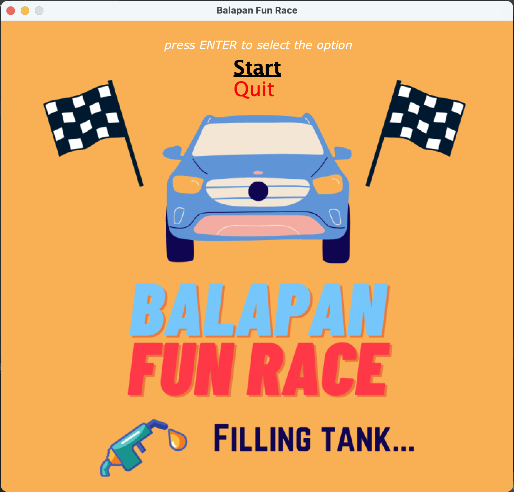
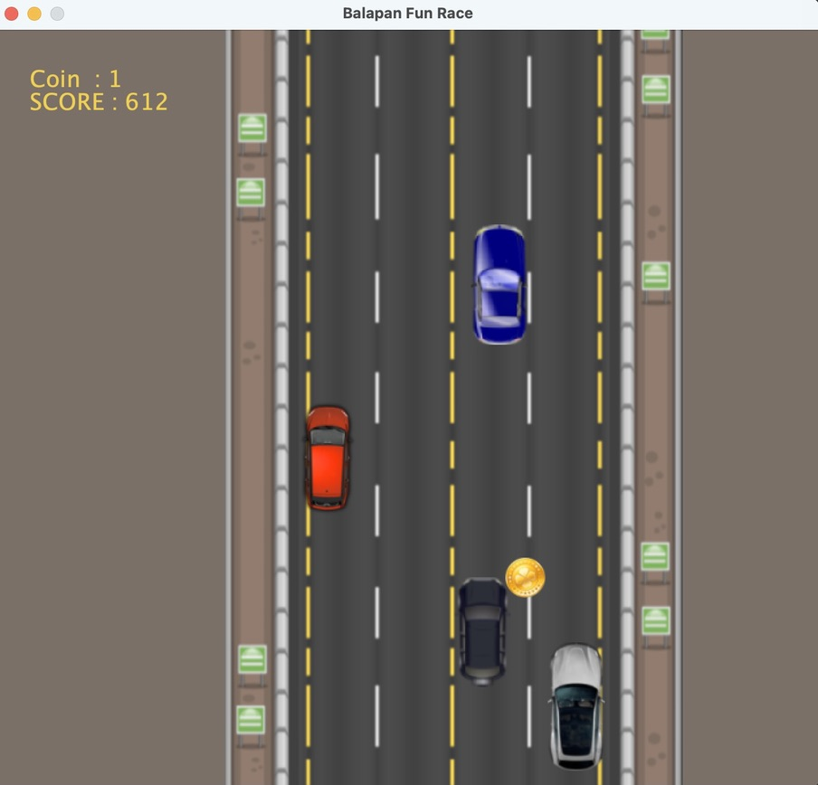
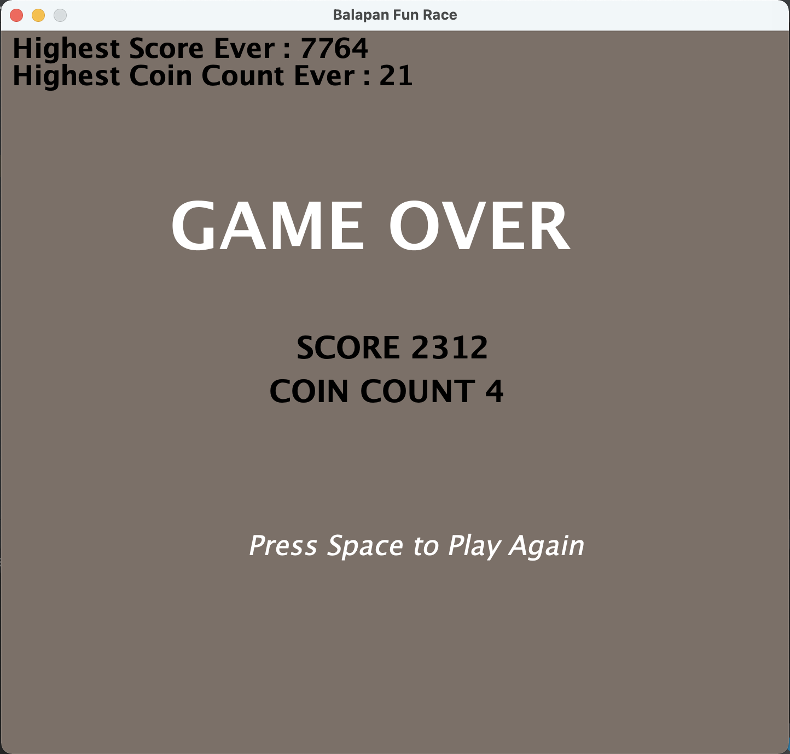

# FunRace

This is a racing gar game created in Java to complete Object Oriented Programming Final Project. User (car) can gain points with reach coin and lose when hit other cars.

## How to Run

Open the app with your IDE, and launch `GameLauncher` class.

## Screenshots

  
   

  

